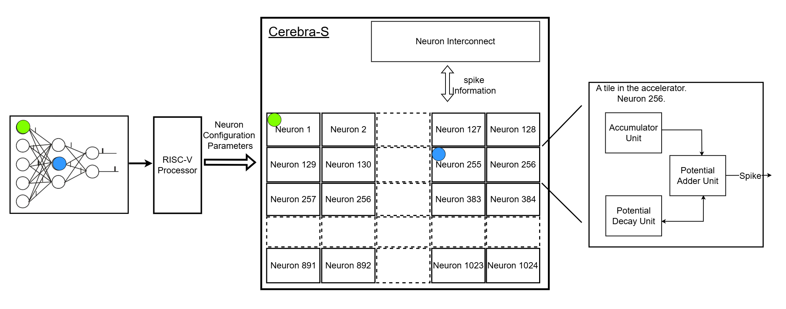
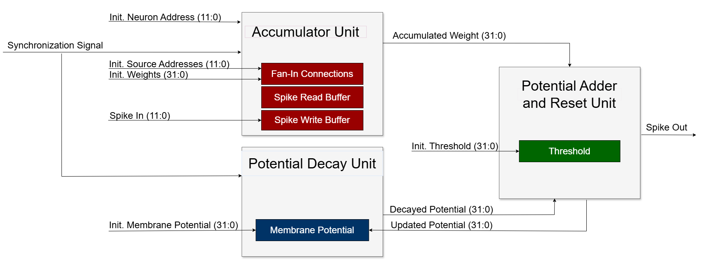
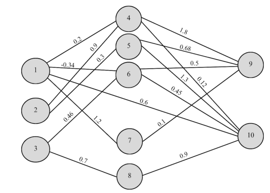
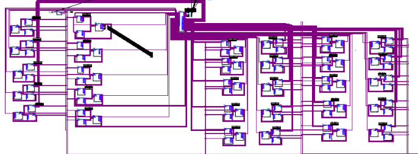
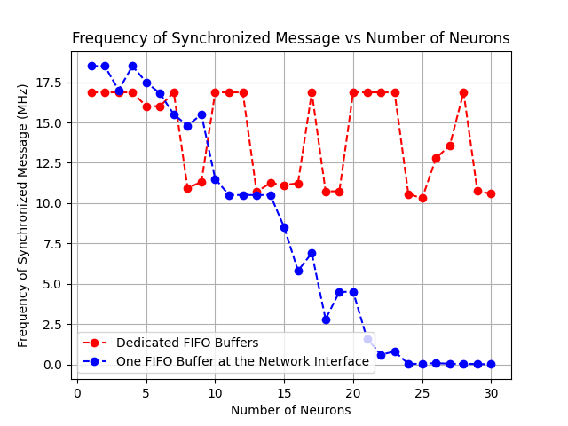

[comment]: # "This is the standard layout for the project, but you can clean this and use your own template"

# Neuromorphic Network-on-Chip Architecture for Spiking Neural Networks

#### Team

- E/18/379, Thamish Wanduragala, [e18379@eng.pdn.ac.lk](mailto:e18379@eng.pdn.ac.lk)
- E/18/147, Saadia Jameel, [e18147@eng.pdn.ac.lk](mailto:e18147@eng.pdn.ac.lk)

#### Supervisors

- Prof. Roshan G. Ragel, [roshanr@eng.pdn.ac.lk](mailto:roshanr@eng.pdn.ac.lk)
- Dr. Isuru Nawinne, [isurunawinne@eng.pdn.ac.lk](mailto:isurunawinne@eng.pdn.ac.lk)

#### Table of content

1. [Abstract](#abstract)
2. [Related works](#related-works)
3. [Methodology](#methodology)
4. [Experiment Setup and Implementation](#experiment-setup-and-implementation)
5. [Results and Analysis](#results-and-analysis)
6. [Conclusion](#conclusion)
7. [Publications](#publications)
8. [Links](#links)

---

<!-- 
DELETE THIS SAMPLE before publishing to GitHub Pages !!!
This is a sample image, to show how to add images to your page. To learn more options, please refer [this](https://projects.ce.pdn.ac.lk/docs/faq/how-to-add-an-image/)
 
-->

## Abstract
The present works of AI show interest in trying to replicate some aspect of brain function. This interest stems from the fact that the brain remains functionally superior to any machine built to date despite consuming power equivalent to that of a compact fluorescent light bulb. 

Spiking Neural Network (SNN), a type of artificial neural network, draws inspiration from the brain and uses spikes as the basis for communication in an event- driven manner. Spiking hardware, or neuromorphic hardware are used to implement spike based algorithms to realize their efficiency in computing and ability of doing so with low power, compared to non- spiking hardware. Neuromorphic architecture focuses on developing neuron models inspired by biological neurons and creating hardware implementations of artificial neurons. 

Our research presents the design of a scalable and configurable Network-on-Chip (NoC) based on the RISC-V instruction set architecture (ISA) which allows for hardware- level processing of spiking neural networks, and the implementation of the design on a FPGA. RISC-V was chosen as the base ISA since it is not only highly practical and popular, but also completely open source and amenable to custom extensions.

The main goal of this research is to optimize the RISC-V processing node network for low power by integrating custom accelerator hardware units.

## Related work
## A. Spiking Neural Networks

<!-- -->

Spiking neural networks fall in the category of artificial neural networks. Several layers of neurons connected by synapses make up an ANN. SNNs follow more complex design rules and represent a newer variant of ANNs, considered to be a third-generation neural network. It resembles the activities of the brain more closely by incorporating time. SNNs transmit spikes as events throughout the neural network. A spike is considered a rapid change of voltage that occurs over a short period of time. When a synapse receives an action potential or a spike from one of its pre-synaptic neurons, it will transmit the spike to its post synaptic neurons. This transmission leads to an update of the postsynaptic neuron’s membrane potential which is influenced by factors such as the weight of the synapses and other neuron parameters.

## B. Neuromorphic Architecture Implementations

Neuromorphic research is still highly exploratory, with several proposed implementations aimed at simulating and accelerating SNNs. Specific hardware has been developed to accurately mimic the behaviour of individual neurons and support collections of such neurons to enable accurate and efficient models of SNNs. 

Intel’s advanced neuromorphic chip [Loihi 1](https://redwood.berkeley.edu/wp-content/uploads/2021/08/Davies2018.pdf) adopts a variation of the CUBA leaky-integrate-and-fire model. It features a manycore mesh comprising of 128 neuromorphic cores. An asynchronous network-on-chip (NoC) transports all communication between cores as packetized messages. A neuromorphic core implements 1024 spiking neural units. All these units including their fan-in and fan-out connectivity share configuration and state variables in ten erchitectural memories within the neuromorphic core. Such a design allows for a single event to be expanded into a large number of specialised dependent events that can operate in parallel to reduce the neuron update and spike resolution latency. 

The [OpenSpike](https://github.com/sfmth/OpenSpike) project by Modaresi, F. et al. and research by Zhang, J. et al. demonstrate the utilisation of Application-Specific Integrated Circuits (ASICs) in developing neuromorphic architectures. It adopts the leaky integrate-andfire neuron model at the hardware level and uses a timemultiplexed accelerator design. It has also a network implementation for interconnection between hardware neurons. On the other hand, [SpiNNaker](https://spinnaker.io/) developed by the Advanced Processor Technologies Research Group (APT) at the Department of Computer Science, University of Manchester focuses more on being large scale and able to simulate the behaviour of aggregates of up to a billion neurons in real time. It utilizes a network of nodes where each node consists of 18 ARM968 cores plus a 128Mbyte off-die Synchronous Dynamic Random Access Memory (SDRAM).

## Methodology

 

The proposed design consists of RISC-V processing nodes specialised to perform operations required to implement spiking networks. The nodes are interconnected using a network interface attached to each processing node. A routing framework is used to negotiate communication between the nodes. Each processing node is responsible for managing one or more
logical neurons. The interconnectivity between nodes enables communication between logical neurons that span across multiple nodes. The architecture adopts an event-driven messaging mechanism to effectively emulate the activity of the spiking
neurons. The motivation for using a RISC-V processing node network lies in the ability to maintain configurability and programmability at the hardware level. This flexibility will be leveraged to support various spiking neuron model
architectures.

 

## Experiment Setup and Implementation
Once the architecture was completed and tested via simulation, it was implemented on an FPGA device, specifically the DE2-115 by Altera. To confirm the implementation, a small-scale SNN was tested on the device.
 

In terms of the number of neurons that can be simulated on the design, we have restricted it to 1,024. This was done with the aim of efficiently supporting this number of neurons in terms of power and time. An SNN with 994 neurons was successfully simulated on the design for the purpose of MNIST classification.

Additionally, an architectural experiment was conducted to differentiate the benefits of using multiple FIFO (First In, First Out) buffers at the output side of the neuron interconnect, as shown in the design view. The objective of the experiment was to observe the difference in operating frequency between using a single FIFO buffer and dedicated FIFO buffers from the neuron interconnect to the neurons. Using the results of this experiment, we were able to find the right balance between resource usage and time efficiency. The circuit made for the timing analysis is shown below. 

 

## Results and Analysis

The below video shows the simualtion of the SNN shown above in the experiment section. It can be seen that the spike resolution is taking place which is mapped on to the red LEDs of the FPGA device. 

https://github.com/cepdnaclk/e18-4yp-Neuromorphic-NoC-Architecture-for-SNNs/raw/main/docs/images/fpga_demo.mp4

The resuts of having a single FIFO buffer and dedicated FIFO buffers can be seen in the graph below.

 

It can be observed that the operating frequency declines sharply as the number of neurons increases when a single FIFO buffer is placed at the output of the network interconnect leading to the accumulator units. Conversely, with dedicated FIFO buffers for each accumulator unit, the frequency remains relatively stable, showing only minor variations within a certain range. This stability is attributed to the absence of bottlenecks as the system scales.

<!--## Conclusion-->
In conclusion, it can be said that while there are designs that facilitate large-scale architectures, there is a scarcity of designs that fully exploit programming flexibility. By targeting small-scale SNNs, our design introduces great flexibility through a combination of the general-purpose RISC-V processor and the accelerator. Although the design does not match the scale of other large-scale architectures, it is optimized for applications that rely on small-scale SNNs, prioritizing performance and low power consumption.

<!-- ## Publications-->
[//]: # "Note: Uncomment each once you uploaded the files to the repository"

<!-- 1. [Semester 7 report](./) -->
<!-- 2. [Semester 7 slides](./) -->
<!-- 3. [Semester 8 report](./) -->
<!-- 4. [Semester 8 slides](./) -->
<!-- 5. Author 1, Author 2 and Author 3 "Research paper title" (2021). [PDF](./). -->

## Links

[//]: # ( NOTE: EDIT THIS LINKS WITH YOUR REPO DETAILS )

- [Project Repository](https://github.com/cepdnaclk/e18-4yp-Neuromorphic-NoC-Architecture-for-SNNs)
- [Project Page](https://cepdnaclk.github.io/e18-4yp-Neuromorphic-NoC-Architecture-for-SNNs/)
- [Department of Computer Engineering](http://www.ce.pdn.ac.lk/)
- [University of Peradeniya](https://eng.pdn.ac.lk/)

[//]: # "Please refer this to learn more about Markdown syntax"
[//]: # "https://github.com/adam-p/markdown-here/wiki/Markdown-Cheatsheet"
